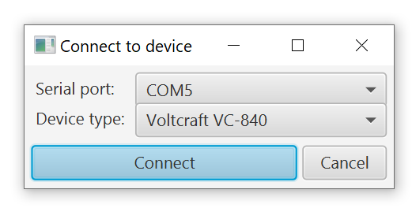
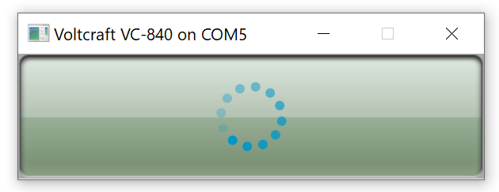
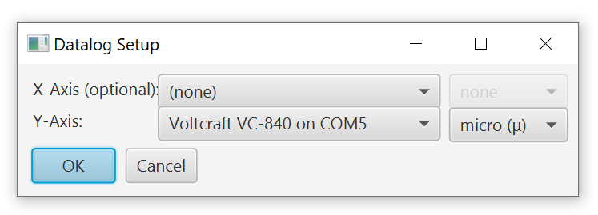
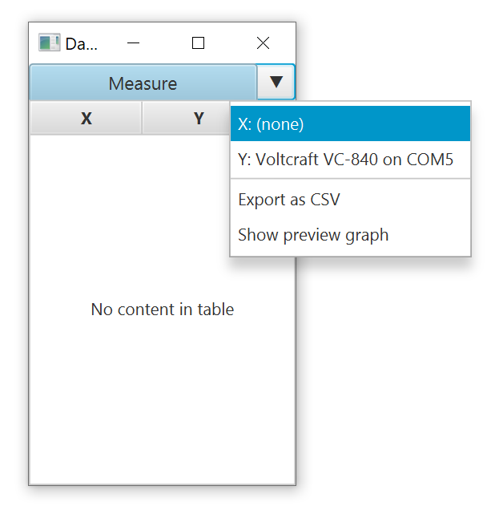
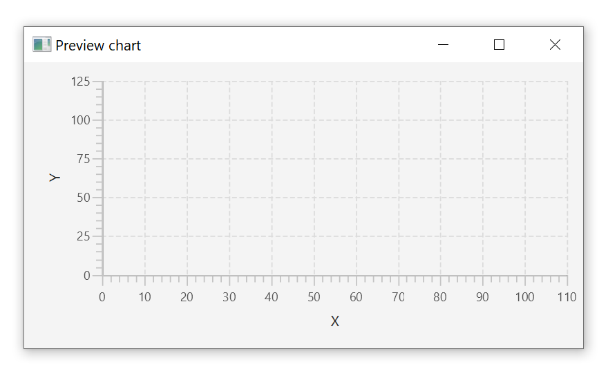

# MultimeterReader

## Introduction
Displays and records live data from your multimeter & exports it as CSV. Works with the tools my high school had at the time: Voltcraft VC840 and ME32, by implementing their custom RS232-based protocols.

I originally wrote this in 2012 for a school project and then ported it to Maven in 2023 - 11 years later.

To implement support for other multimeters, extend the [DataSource](src/main/java/com/mtreader/api/DataSource.java) class and (optionally) take a look at [VoltcraftVC840](src/main/java/com/mtreader/api/impl/VoltcraftVC840.java) as an example.

## Running the Application
Tested on Windows 10, but should work on Linux and x64 macOS as well. 

Using JDK >= 18 and Apache Maven, run ``mvn package`` to create a JAR with all required dependencies. Then run the jar file in the target folder.

Alternatively, import the Maven project into your IDE of choice and run the ``com.mtreader.MTReaderExec`` class.